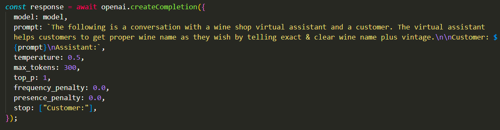
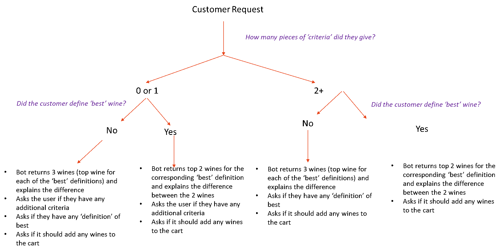

# Wine Service(Server based Fine-Tuning)

> This is part of Wine Service Project. Express Server based on Fine-Tuning.

## Table of Contents

- [General Info](#general-information)
- [Technologies Used](#technologies-used)
- [Features](#features)
- [Screenshots](#screenshots)
- [Setup](#setup)
- [Usage](#usage)
- [Project Status](#project-status)
- [Room for Improvement](#room-for-improvement)
- [Acknowledgements](#acknowledgements)
- [Contact](#contact)

## General Information

- AI chat bot that can assist potential customers in a store or at home
- The AI chat bot can talk to the customer, learn about the wines we have to sell, and recommend the best wine for that customer.
- The purpose of my project is to help customers select the wine to purchase that is best for them.
- My first challenge on OpenAI

## Technologies Used

- Tech 1 - OpenAI API
- Tech 2 - Fine-Tuning
- Tech 3 - Express

## Features

- Deal with request from client's wine requests
- Make request to OpenAI API

## Screenshots

## Setup

You need Node.js platform to setup this project.

## Usage

1. Clone the project: `git clone`
2. Create .env file and put your OPENAI_API_KEY there.
3. Run the project: `npm run server`

## Project Status

Project is: _no longer being worked on_. The reason is AI replies with non-factal data.

## Room for Improvement

Room for improvement:

- Fine-Tuned model Use
- Prompt Engineering
- Express Server

To do:

- Awersome prompt build up
- Solve issue by fine-tuning

## Acknowledgements

- This project was inspired by Valentyn.
- This project was based on [this tutorial](https://openai.com/api/docs/).
- Many thanks to Valentyn.

## Contact

Created by [@violetstar701](https://www.) - feel free to contact me!
